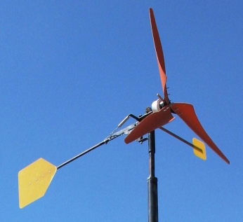
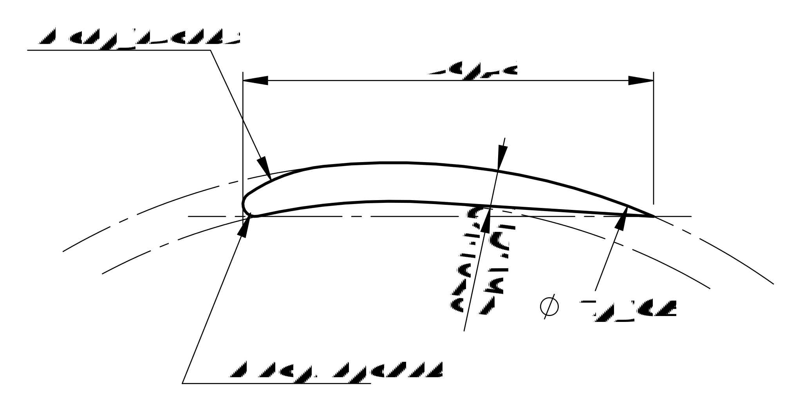

# pipefoil

Генерация профиля крыла из пластиковой трубы для исследования в [xflr⁵](http://www.xflr5.tech/xflr5.htm)

## Вместо предисловия (которое можно не читать)

В последнее время народ приспособился делать лопасти для ветряков из пластиковых канализационных труб.

[источник изображения](https://econet.ru/articles/111806-zhitel-altayskogo-kraya-skonstruiroval-energogenerator-dlya-slabogo-vetra)

Они дёшевы, доступны, обрабатывать их легко. Однако, каковы характеристики таких лопастей?
[Xflr⁵](http://www.xflr5.tech/xflr5.htm) позволяет нарисовать и виртуально «продуть» любой профиль, но попытка загрузить туда профиль, нарисованый в AutoCAD'е успехом не увенчалась.
При этом формат `.dat` файлов, в которых [xflr⁵](http://www.xflr5.tech/xflr5.htm) хранит профили, очень простой: координаты точек, которые соединяют плавной линией.
Ну я и написал прогу, которая вычисляет эти точки для профиля крыла, который можно вырезать из пластиковой трубы.

## Запуск программы

`pipefoil ⌀_трубы стенка_трубы хорда R_передней_кромки R_скругл_передней_кромки`

результат своей работы прога просто вываливает на `stdout`.
Для 160-ой «рыжей» канализационной трубы получится что-то вроде:

`pipefoil 160 4.7 50 1.5 18 >1.dat`

Получившейся `1.dat` скармливаем [xflr⁵](http://www.xflr5.tech/xflr5.htm). После загрузки профиля, не забудьте нажать <kbd>F3</kbd>, чтоб [xflr⁵](http://www.xflr5.tech/xflr5.htm) «сгладил» профиль сплайном!

### Усё
